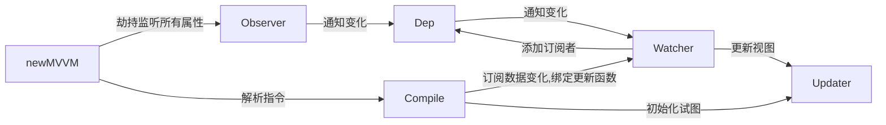

## 一. Vue2

#### vue工作机制

初始化，在new vue()之后，首先在内部执行了一个初始化方法，它做的就是一些最基础的东西的初始化，比如说初始化生命周期，我们知道有很多生命周期的钩子，还有一些props，还有我们一些数据data的响应化等，其中最重要的是通过object.defineProperty设置getter和setter函数，用来实现响应式以及依赖收集。 

在初始化之后调用$mount来执行挂载函数，我们知道Vue的初始化就是通过$mount来实现的，$mount其实就是要指定一个挂载节点，可能会是一个目标节点，也有可能会是一个dom节点，最终就是告诉我们vue将把那些写好的模板通过编译以后达到更新以后这个最新的东西 我到底要显示在什么地方，就是$mount最终指定的那个目标，然后$mount会启动这个编译器compile，这个编译器最重要的事情就是对我们的Template里的东西进行一遍扫描，做parse optimize generate这三件事，compile在这个阶段会生成一些渲染函数或者也可以叫更新函数，会生成一颗树，我们叫虚拟节点树，将来在做数据更新的时候，其实我们改变的数据并不是真正的dom操作，而是这个虚拟dom上的数值，当我们准备更新之前我们会做一个diff算法的比较，通过最新的值和之前的老值进行比较，从而计算出我们应该做的最小的dom更新，然后我们才开始执行到这个patch步骤来打补丁做界面更新，这样儿做的目的是用js里面的计算时间来换dom操作时间，我们知道浏览器的瓶颈在对页面操作这一块儿比较耗时间，**Vue的核心在于减少页面渲染的次数和数量**，compile除了编译渲染函数之外，还会做一个依赖收集的工作，通过这个依赖收集我们可以知道当页面数据发生变化的时候我应该去更新页面中的那一个dom节点，这也就是将来这个数据发生变化的时候，我们可以通过这个watcher观察者来知道数据发生变化，这时候调用更新渲染函数来打补丁。

上述提到的编译器在扫描dom的时候做的三件事儿parse optimize generate

1 parse是使用正则解析template中的vue指令变量等，形成语法树AST

2 optimize 标记一些静态节点，用作后面的性能优化，在diff的时候直接略过

3 generate 把第一部生成的AST转化为渲染函数

#### vue响应式原理

从原理上来讲vue是利用了Object的defineProperty的属性，它把我们数据data中放的每一个属性，都定义成一个属性，赋予了getter和setter,这样儿的话让我们有机会去监听这些属性的变化，当这些属性发生变化的时候，我们可以通知那些需要更新的地方去更新。

> 减少页面渲染次数和数量，用js运行时间来换取DOM渲染时间
> 
> 虚拟DOM：利用js对象来模仿DOM，生成语法树

#### MVVM框架简单的实现

vue数据绑定原理（数据劫持）：

vue利用了es5 中的object的defineProperty，在defineProperty中设置了get和set方法，对每个数据进行监听，当监听到数据发生变化的时候，就去更新需要更新的地方。

依赖收集与追踪

为什么要编译？

我们先说什么是编译，为什么要编译，首先因为vue写的html模板，是浏览器识别不了的，我们通过编译的过程，可以进行依赖收集，进行依赖收集之后我们就把Data中的数据模型和视图之间产生依赖关系，当模型发生变化的时候，我们就可以通知这些依赖的地方让他们进行更新，这就是我们执行编译的目的，我们把这些界面全部编译以后，更新操作，我们就可以做到模型驱动视图的变化这就是编译的过程。

question:

+ 如何监听数组中的push
+ 组件的实现

# 二. 怎么理解Vue中的Diff算法

源码分析1：必要性，lifecycle.js - mountComponent()
组件中可能存在很多个data中的key使用

源码分析2：执行方式，patch.js - patchVnode()
patchVnode是diff发生的地方，整体策略：深度优先，同层比较

源码分析3：高效性，patch.js - updateChildren()

## Diff算法总结

- diff算法是虚拟DOM技术的必然产物：通过新旧虚拟DOM作对比（即diff），将变化的地方更新在真实DOM上；另外，也需要diff高效的执行对比过程，从而降低时间复杂度为O(n)。
- vue 2.x中为了降低Watcher粒度，每个组件只有一个Watcher与之对应，只有引入diff才能精确找到发生变化的地方。
- vue中diff执行的时刻是组件实例执行其更新函数时，它会比对上一次渲染结果oldVnode和新的渲染结果newVnode，此过程称为patch。
- diff过程整体遵循深度优先、同层比较的策略；两个节点之间比较会根据它们是否拥有子节点或者文本节点做不同操作；比较两组子节点是算法的重点，首先假设头尾节点可能相同做4次比对尝试，如果没有找到相同节点才按照通用方式遍历查找，查找结束再按情况处理剩下的节点；借助key通常可以非常精确找到相同节点，因此整个patch过程非常高效。

# 三. Vue2 常见缺陷

- 开发维护的角度看，Vue 2 是使用 Flow.js 来做类型校验。但现在 Flow.js 已经停止维护了，整个社区都在全面使用 TypeScript 来构建基础库，Vue 团队也不例外。

- 社区二次开发难度看，Vue2内部运行时，是直接执行浏览器的API的。这样给vue2 的跨端方案带了了不少问题，常见的解决方案有：
  
  - 直接进入Vue源码和Vue一起维护，比如Vue2中能看见Week的文件夹；
  
  - 赋值一份Vue的代码，把浏览器的API转换成客户端或者小程序的，如mpvue小程序框架；

- Vue2是基于 Object.defineProperty() 实现的，在ES6 前，JavaScript缺少元编程能力，无法监测到属性的删除和新增。这是为什么需要`$delete` 和 `$set`的API；

- Option API 的组织在**代码多**、**组件多**的时候不易维护。所有的 methods、computed 都在一个对象里配置，这对小应用来说还好。但代码超过 300 行的时候，新增或者修改一个功能，就需要不停地在 data，methods 里跳转写代码，上下反复横跳。

# 四. Vue3

[开课吧vue3源码简略解析](https://learn.kaikeba.com/video)

### a. 初始化流程

+ createApp() 创建vue实例

+ 真正的实例创建者randerer.createApp()
  
  + createAppAPI才是真正创建应用实例的地方

+ mount挂载
  
  + 先得到虚拟DOM

### b. VUE3 新特性（性能提升）

#### 1. 响应式系统

- 使用proxy是真正代理，替换掉了以前的Object.defineProperty()  （上面有它的缺点，它仅是数据的绑定）；

- proxy拦截数据，不关心数据是具体是什么属性，统一拦截。且Proxy可以监听更多的数据类型，如Set、Map等数据类型；

**proxy的问题：**

- proxy是浏览器的新特性，存在一些兼容性问题，这也是为什么 Vue 3 不兼容 IE11 以下的浏览器的原因；

#### 2. 自定义渲染器（跨端使用）

- Vue 2 内部所有的模块都是揉在一起的，扩展性差。

- Vue 3使用monorepo管理方法，响应式、编译和运行时全部独立了，Vue3源码的目录结构中也可以看出。

- Vue3 的响应式是独立开来的，甚至可以在 Node.js 和 React 中使用响应式。

- 渲染的逻辑也拆成了**平台无关**渲染逻辑和浏**览器渲染**  两部分API。

一句话总结：可以像搭积木一个样的搭建自己的应用。响应式、编译和运行时几部分组合在一起就是运行在浏览器端的 Vue 3。

(ps.  Monorepo的意思是在版本控制系统的单个代码库里包含了许多项目的代码。这些项目虽然有可能是相关的，但通常在逻辑上是独立的，并由不同的团队维护。)

#### 3. 全部模块使用 TypeScript 重构

引入了TypeScript这个类型系统，对JavaScript（弱类型语言）进行限制，有以下好处：

- 第一点是，类型系统带来了更方便的提示；

- 第二点是，类型系统让代码更健壮。

#### 4. Composition API 组合语法

使用 Composition API后，代码看起来很烦琐，没有 Vue 2中 Options API的写法简单好懂。

但 **Options API** 的写法也有几个很严重的问题：

- 由于所有数据都挂载在 this 之上，因而 Options API 的写法对 TypeScript 的类型推导很不友好，并且这样也不好做 Tree-shaking 清理代码。

- 增加新功能基本都得修改 data、method 等配置，并且代码上 300 行之后，会经常上下反复横跳，开发很痛苦。

- 代码不好复用，Vue 2 的组件很难抽离通用逻辑，只能使用 mixin，还会带来命名冲突的问题。

我们使用 Composition API 后，虽然看起来烦琐了一些，但是带来了**诸多好处**：

- 所有 API 都是 import 引入的。用到的功能都 import 进来，对 Tree-shaking 很友好，我的例子里没用到功能，打包的时候会被清理掉 ，减小包的大小。

- 不再上下反复横跳，我们可以把一个功能模块的 methods、data 都放在一起书写，维护更轻松。

- 代码方便复用，可以把一个功能所有的 methods、data 封装在一个独立的函数里，复用代码非常容易。

- Composotion API 新增的 return 等语句，在实际项目中使用 <script setup> 特性可以清除。

#### 5. 新增组件

Vue 3 还内置了 Fragment、Teleport 和 Suspense 三个新组件。

- Fragment: Vue 3 组件不再要求有一个唯一的根节点，清除了很多无用的占位 div。

- Teleport: 允许组件渲染在别的元素内，主要开发弹窗组件的时候特别有用。

- Suspense: 异步组件，更方便开发有异步请求的组件。

#### 6. Vite 和 webpack

**webpack打包原理**

- 1.先逐级递归识别依赖，构建依赖图谱
- 2.将代码转化成AST抽象语法树
- 3.在AST阶段中去处理代码
- 4.把AST抽象语法树变成浏览器可以识别的代码， 然后输出

**vite原理**：

- 当声明一个 script 标签类型为 module 时；
- 浏览器就会向服务器发起一个GET；
- 浏览器请求到了main.js文件，检测到内部含有import引入的包，又会对其内部的 import 引用发起 HTTP 请求获取模块的内容文件；对非esm标准的代码，vite则是转化成esm标准的代码。
- `Vite` 的主要功能就是通过劫持浏览器的这些请求，并在后端进行相应的处理将项目中使用的文件通过简单的分解与整合，然后再返回给浏览器；vite整个过程中没有对文件进行打包编译，所以其运行速度比原始的`webpack`开发编译速度快出许多；

**对比：**

- Vite 将会使用 `esbuild` 预构建依赖。Esbuild 使用 Go 编写，并且比以 `Node.js` 编写的打包器预构建依赖快 10-100 倍。
- 缺点：原因在于esbuild对于css和代码分割不是很友好

### c. Vue 3发布会PPT总结

- 更快
  - 虚拟DOM重写：更加细致了，如createComponentVNode()和createElementVNode()做了精细处理，他们新增了第四个参数，用来判断是否存在子节点；
  - 优化slot的生成；
  - 静态树提升：在render函数前，把静态节点进行保存，直接放在render函数里面，不会再修改静态节点；在做patch的时候，很容易判断他没有改变，直接跳过；
  - 静态属性提升方法：在render函数前，把静态属性（如class）进行保存；
  - 基于Proxy的响应式系统，不需要递归。组件实例初始化的速度提高100％；内存开销节省了一半；
- 更小：　通过摇树优化核心库体积（摇树优化：清除没有用的代码，减少代码体积）
- 更容易维护：TypeScript + 模块化
- 更加友好
  - 跨平台：编译器核心和运行时核心与平台无关，使得Vue更容易与任何平台（Web、Android、iOS）一起使用；（源码里面模块化清晰，有好多个编译器，DMON编译器＼单文件＼服务端渲染都有独立的编译器，以后也可以编写一些Android＼IOS的编译器，因为平台十分友好）
- 更容易使用
  - 改进的TypeScript支持，编辑器能提供强有力的类型检查和错误及警告；
  - 更好的调试支持；
  - 独立的响应化模块；
  - Composition API　

# 五. Vue和React对比

**相同点：**

- 都支持组件化与虚拟 DOM
- 都支持 props 进行父子组件通信
- 都支持数据驱动视图，不支持操作 真实 DOM，更新状态视图自动更新
- 都支持服务器端渲染

**不同点：**

- vue 数据双向绑定，react 数据单向绑定；
-  Vue 和 React 在数据发生变化后，在通知页面更新的方式上有明显的不同，通俗的来说，就是：在 Vue 框架下，如果数据变了，那框架会主动告诉你修改了哪些数据；而 React 的数据变化后，我们只能通过新老数据的计算 Diff 来得知数据的变化。

- 组 件 写 法 不 同 。 react 推 荐 jsx 写法，即把 html 与 css 都 写 进 js; vue 推 荐
  webpack+vue-loader 的单文件组件格式，即 html、css 与 js 都写进同一个文件；
  - React 的世界里只有 JSX，最终 JSX 都会在 Compiler 那一层，也就是工程化那里编译成 JS 来执行，所以 React 最终拥有了全部 JS 的动态性，这也导致了 React 的 API 一直很少，只有 state、hooks、Component 几个概念，主要都是 JavaScript 本身的语法和特性。
  - 而 Vue 的世界默认是 template，也就是语法是限定死的，比如 v-if 和 v-for 等语法。有了这些写法的规矩后，我们可以在上线前做很多优化。Vue 3 很优秀的一个点，就是在虚拟 DOM 的静态标记上做到了极致，让静态的部分越过虚拟 DOM 的计算，真正做到了按需更新，很好的提高了性能。

- state 对象在 react 中是不可变的，需要使用 setState 方法更新状态；而 vue 中 state 不
  是必须的，数据由 data 在 vue 对象中管理；
- 虚拟 DOM 不一样，vue 会跟踪每一个组件的依赖关系，不需要重新渲染整个组件树；react 
  每当应用状态改变时，全部组件都会重新渲染，所以 react 需要 shouldComponentUpdate 这
  个生命周期方法来进行控制；

**Svelte框架：**

在模板的书写上，除了 Vue 和 React 走出的 template 和 JSX 两个路线，还出现了 **Svelte ** 这种框架，没有虚拟 DOM 的库，直接把模板编译成原生 DOM，几乎没有 Runtime，所有的逻辑都在 Compiler 层优化，算是另外一个极致。

**Vue1和React早期瓶颈：**

- 对于vue来说，核心就是响应式，根据对每一个数据都绑定一个watcher来监听，但这种监听本身就是比较消耗性能的，项目大之后，数据多了绑定的watcher多了，性能也会卡顿；

- 对于 React 的虚拟 DOM 的 Diff 计算逻辑来说，如果虚拟 DOM 树过于庞大，使得计算时间大于 16.6ms，那么就可能会造成性能的卡顿。

**解决方法：**

- React 为了突破性能瓶颈，借鉴了操作系统时间分片的概念，引入了 Fiber 架构。通俗来说，就是把整个虚拟 DOM 树微观化，变成链表，然后我们利用浏览器的空闲时间计算 Diff。一旦浏览器有需求，我们可以把没计算完的任务放在一旁，把主进程控制权还给浏览器，等待浏览器下次空闲。（为什么是链表呢？）
  
  - 树形结构的 Diff 很难中断；把树形结构改造成了链表，遍历严格地按照子元素 -> 兄弟元素 -> 父元素的逻辑，随时可以中断和恢复 Diff 的计算过程。

- Vue 2通过引入虚拟 DOM 来解决响应式数据过多的问题。
  
  - 响应式数据是主动推送变化，虚拟 DOM （组件内虚DOM）是被动计算数据的 Diff，一个推一个拉，它们看起来是两个方向的技术，但被 Vue 2 很好地融合在一起，采用的方式就是组件级别的划分。

**思考题在你看来，Vue 需不需要 React 的 Fiber 呢？**

虚拟Dom控制在组件级，最早Vue3的提案其实是包含时间切片方案的，最后废弃的主要原因，是时间切片解决的的问题，Vue3基本碰不到

1. Vue3把虚拟Dom控制在组件级别，组件之间使用响应式，这就让Vue3的虚拟Dom不会过于庞大
2. Vue3虚拟Dom的静态标记和自动缓存功能，让静态的节点和属性可以直接绕过Diff逻辑，也大大减少了虚拟Dom的Diff事件
3. 时间切片也会带来额外的系统复杂性
